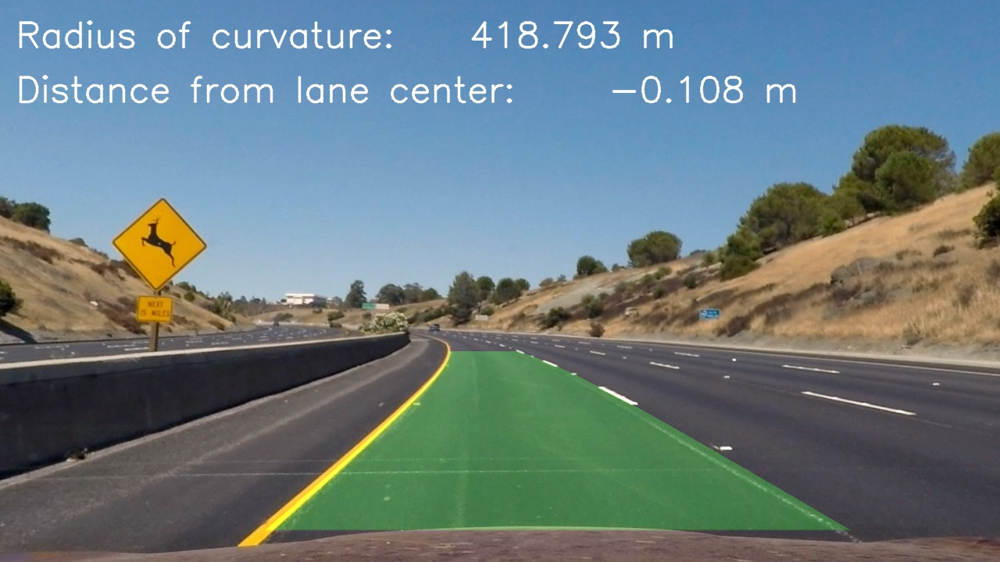
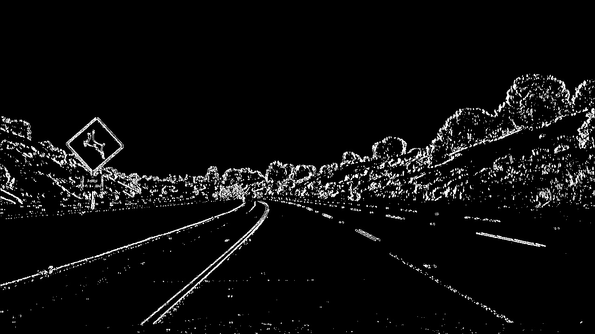
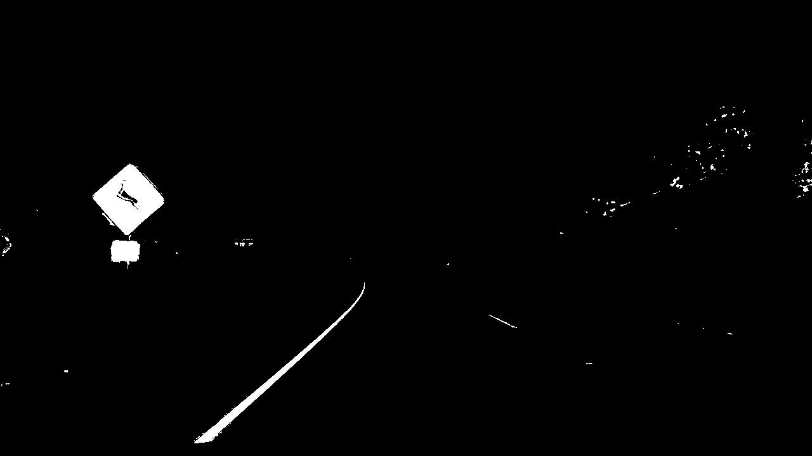
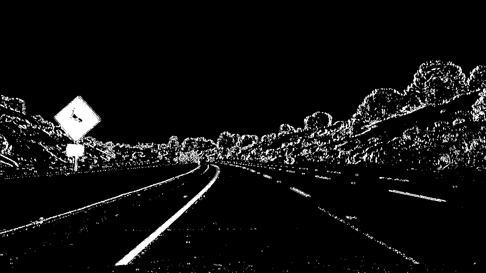
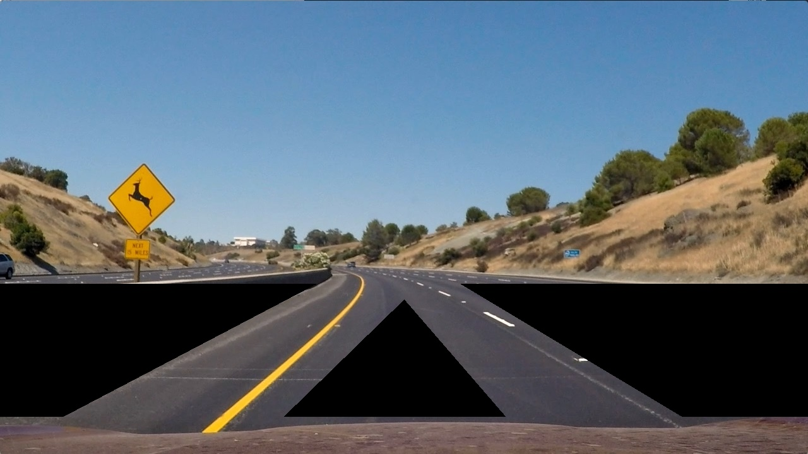
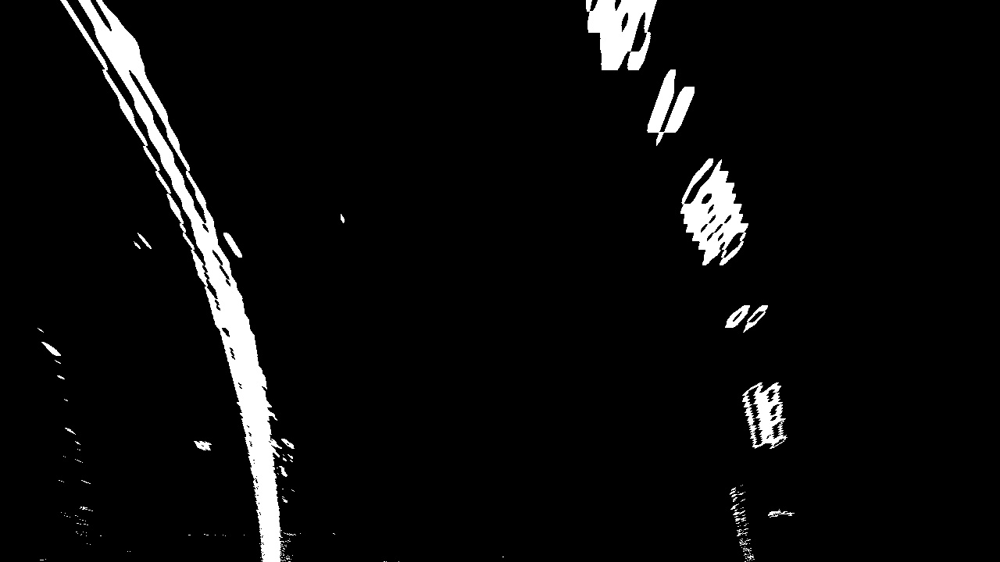
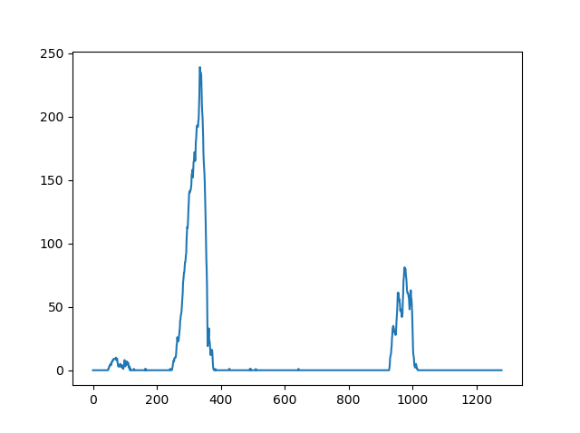
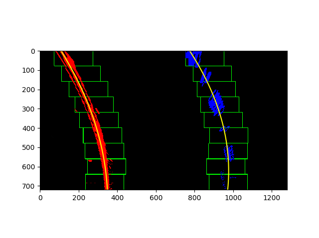

## Advanced Lane Finding
[](http://www.udacity.com/drive)


In this project, the goal was to write a software pipeline to identify the lane boundaries in a video, but the main output or product was to create is a detailed writeup of the project. 

## Summary - The goals / steps of this project were the following:

* STEP 1: Compute the camera calibration matrix and distortion coefficients given a set of chessboard images.
* STEP 2: Apply a distortion correction to raw images.
* STEP 3: Use color transforms, gradients, etc., to create a thresholded binary image.
* STEP 4: Apply a perspective transform to rectify binary image ("birds-eye view").
* STEP 5: Detect lane pixels and fit to find the lane boundary.
* STEP 6: Determine the curvature of the lane and vehicle position with respect to center.
* STEP 7: Warp the detected lane boundaries back onto the original image.
* STEP 8: Output visual display of the lane boundaries and numerical estimation of lane curvature and vehicle position.

The images for camera calibration were stored in the folder called `camera_cal`. The images in `test_images` are for testing the pipeline on single frames. 

## Now the details:

# STEP 1: (camera_calibration.py)
The camera calibration was done in a separate python script (camera_calibration.py), because it is usually run only once. The code has been taken more or less from Lession 6 "Camera Calibration". To calibrate a camera, an image with known proportion can be taken, like a chess board. In this case a 9x6 chessboard was photographed from many angles and perspective. Then each image is read and converted to gray, and the OpeCV function cv2.findChessboardCorners() is called. This function returns a list of 2d image points / coordinates of the chessboard tiles. This list is appended to a list of imagepoints, while a corresponding list of 3d object points is written to a list called objectpoints. Object points, is a prodefined list like (0,0,0), (1,0,0), (2,0,0) ....,(6,5,0). After all images have been read, the opencv function cv2.calibrateCamera is used to calculate calibration matrix and distortion coefficients. At leas 20 images are needed for this calibration process.

At the end of this script, the newly calculated calibration matrix and distortion coefficients can be tested on an undistored image.

After undistortion, this image  


becomes this image: 

These are the calculated calibration matrix and distortion coefficients which are going to be hardcoded in part 2 of this submission (lane_detection.py).

```
Distortion Coefficient:
[[-0.24688775 -0.02373133 -0.00109842  0.00035108 -0.00258571]]
Camera Matrix:
[[1.15777930e+03 0.00000000e+00 6.67111054e+02]
 [0.00000000e+00 1.15282291e+03 3.86128937e+02]
 [0.00000000e+00 0.00000000e+00 1.00000000e+00]]
```


lane_line_detection.py is the main program for this project. In this program we open a video (or simgle image) and apply the "pipeline" to each frame. STEP 2-8 are in this python script.

For each frame the first thing we do is to undistort the frame, according to the calibration matrix and distortion coefficients from STEP 1. We hard coded these values in this python script. Line 21, 22:

```
dist = np.matrix([-0.24688775,-0.02373133,-0.00109842,0.00035108,-0.00258571])
mtx = np.matrix([[1.15777930e+03,0.00000000e+00,6.67111054e+02],[0.00000000e+00,1.15282291e+03,3.86128937e+02],[0.00000000e+00,0.00000000e+00,1.00000000e+00]])
```

# STEP 2: Apply a distortion correction to raw images (lane_line_detection.py)

In Line 231 we undistort the frame with the opencv function undistort and the calibration matrix and distortion coefficients from the previous step.
```
undistortedFrame = cv2.undistort(originalFrame, mtx, dist, None, mtx)
```

# STEP 3 - Use color transforms, gradients, etc., to create a thresholded binary image

In the function get_warped_binary we do all the steps recommended in Lesson 8, Gradients and Color spaces. This includes converting the image to HLS color space and using Sobel on the L channel in the x direction (x-gradient). Additionally we absolute the x derivative to accentuate lines away from horizontal. Finally we normalize sobelx values and we create a binary image by using some treshholds. Note: to view your binary image use ```  cv2.imshow('sxbinary', sxbinary*255) ``` (multiplay the image by 255, otherwise its black!)

```
# Convert to HLS color space and separate the V channel
hls = cv2.cvtColor(img, cv2.COLOR_RGB2HLS)
l_channel = hls[:,:,1]
s_channel = hls[:,:,2]

# Sobel x
sobelx = cv2.Sobel(l_channel, cv2.CV_64F, 1, 0) # Take the derivative in x
abs_sobelx = np.absolute(sobelx) # Absolute x derivative to accentuate lines away from horizontal
scaled_sobel = np.uint8(255*abs_sobelx/np.max(abs_sobelx))

# Threshold x gradient
sxbinary = np.zeros_like(scaled_sobel)
sxbinary[(scaled_sobel >= sx_thresh[0]) & (scaled_sobel <= sx_thresh[1])] = 1
```

The resulting image looks like this (x-gradient): 

After this we treshhold the s_channel (as recommended in Lessom 8)

```
# Threshold color channel
s_binary = np.zeros_like(s_channel)
s_binary[(s_channel >= s_thresh[0]) & (s_channel <= s_thresh[1])] = 1

```

The resulting image looks like this (s_channel): 

After this step we combine both binary images (x-gradient and s_channel)

```
# Combine the two binary thresholds
combined_binary = np.zeros_like(sxbinary)
combined_binary[(s_binary == 1) | (sxbinary == 1)] = 1    
```

Here is the result:


Next, we apply a mask, to get rid of parts of the image that might give wrong clues about lane lines. Here is the mask I use:



Note, the mask is applied to the binary image, not to the original image!


# STEP 4: Apply a perspective transform to rectify binary image ("birds-eye view").

```
binary_warped = cv2.warpPerspective(combined_binary, M, img_size, flags=cv2.INTER_LINEAR)
```

The Matrix M (and Minv) has been created previouly, according to the concept of "Perspective Transform" as explained in Lesson 7. By specifying 2d coordinates of your 3d image, and transforming them to a square, you get a birds eye view of your street.

```
# source and destination points (top left, top right, bottom right, bottom left) for warping street to birds view 
src = np.float32([[600, 450], [690, 450], [1100, 680], [280, 680]])     # these are the coodinates of the street

dst = np.float32([[offset_x, offset_y], [img_size[0]-offset_x, offset_y], [img_size[0]-offset_x, img_size[1]-offset_y], [offset_x, img_size[1]-offset_y]])
                
# use cv2.getPerspectiveTransform() to get M and Minv, the transform matrix and inverse transform matrices to warp the street to birds view and back
M = cv2.getPerspectiveTransform(src, dst)
Minv = cv2.getPerspectiveTransform(dst,src)
```

The resulting "warped" image looks like this:



# STEP 5 - Detect lane pixels and fit to find the lane boundary

In step 5 we are passing the warped/top down  view of the road binary image to the function "fit_polynomial", to determine the actual curve / lane lines.

```
left_fit_p, right_fit_p, left_curverad, right_curverad, left_fit_m, right_fit_m = fit_polynomial(binary_warped)
```
(If you want to visualize the boxes and actual lines lines, append "True" to the call to fit_polynomial: ``` fit_polynomial(binary_warped, True) ```

The function fit_polynomial in turn calls "find_lane_pixels" to find the lane pixels.

In find_lane_pixels we do the following:

Take a histogram of the bottom half of the image

```
histogram = np.sum(binary_warped[binary_warped.shape[0]//2:,:], axis=0)
```

to visualize the histogram do this

```
plt.plot(histogram)
plt.show()
```

and the result will be the following image. Here we see at which x coordinate in the bottom half of the image we have the most pixels - this is a very good indicator of where the line starts.


Next, we create an output image to draw on and visualize the result. np.dstack takes a sequence of arrays and stack them along the third axis to make a single array. This is a simple way to stack 2D arrays (images) into a single 3D array for processing. If we pass in 3 times our binary image, we get 3D array for processing.

```
out_img = np.dstack((binary_warped, binary_warped, binary_warped))
```

Find the peak of the left and right halves of the histogram. These will be the starting point for the left and right lines.
numpy.argmax returns the indices of the maximum values along an axis.

```
midpoint = np.int(histogram.shape[0]//2)      # for the current frame, the result is midpoint=640; // make a div with an int as result
leftx_base = np.argmax(histogram[:midpoint])  # for the current frame, the result is leftx_base=335
rightx_base = np.argmax(histogram[midpoint:]) + midpoint  # for the current frame, the result is rightx_base=975
```


# HYPERPARAMETERS
# Choose the number of sliding windows
nwindows = 9
# Set the width of the windows +/- margin
margin = 100
# Set minimum number of pixels found to recenter window
minpix = 50

# Set height of windows - based on nwindows above and image shape
window_height = np.int(binary_warped.shape[0]//nwindows)
# Identify the x and y positions of all nonzero pixels in the image
nonzero = binary_warped.nonzero()
nonzeroy = np.array(nonzero[0])
nonzerox = np.array(nonzero[1])
# Current positions to be updated later for each window in nwindows
leftx_current = leftx_base
rightx_current = rightx_base

# Create empty lists to receive left and right lane pixel indices
left_lane_inds = []
right_lane_inds = []

# Step through the windows one by one
for window in range(nwindows):
    # Identify window boundaries in x and y (and right and left)
    win_y_low = binary_warped.shape[0] - (window+1)*window_height
    win_y_high = binary_warped.shape[0] - window*window_height
    win_xleft_low = leftx_current - margin
    win_xleft_high = leftx_current + margin
    win_xright_low = rightx_current - margin
    win_xright_high = rightx_current + margin
    
    # Draw the windows on the visualization image
    cv2.rectangle(out_img,(win_xleft_low,win_y_low),
    (win_xleft_high,win_y_high),(0,255,0), 2) 
    cv2.rectangle(out_img,(win_xright_low,win_y_low),
    (win_xright_high,win_y_high),(0,255,0), 2) 
    
    # Identify the nonzero pixels in x and y within the window #
    good_left_inds = ((nonzeroy >= win_y_low) & (nonzeroy < win_y_high) & 
    (nonzerox >= win_xleft_low) &  (nonzerox < win_xleft_high)).nonzero()[0]
    good_right_inds = ((nonzeroy >= win_y_low) & (nonzeroy < win_y_high) & 
    (nonzerox >= win_xright_low) &  (nonzerox < win_xright_high)).nonzero()[0]
    
    # Append these indices to the lists
    left_lane_inds.append(good_left_inds)
    right_lane_inds.append(good_right_inds)
    
    # If you found > minpix pixels, recenter next window on their mean position
    if len(good_left_inds) > minpix:
        leftx_current = np.int(np.mean(nonzerox[good_left_inds]))
    if len(good_right_inds) > minpix:        
        rightx_current = np.int(np.mean(nonzerox[good_right_inds]))

# Concatenate the arrays of indices (previously was a list of lists of pixels)
try:
    left_lane_inds = np.concatenate(left_lane_inds)
    right_lane_inds = np.concatenate(right_lane_inds)
except ValueError:
    # Avoids an error if the above is not implemented fully
    pass

# Extract left and right line pixel positions
leftx = nonzerox[left_lane_inds]
lefty = nonzeroy[left_lane_inds] 
rightx = nonzerox[right_lane_inds]
righty = nonzeroy[right_lane_inds]

return leftx, lefty, rightx, righty, out_img





# STEP 6 - Determine the curvature of the lane and vehicle position with respect to center

# STEP 7 - Warp the blank back to original image space using inverse perspective matrix (Minv)

# STEP 8 Output visual display of the lane boundaries and numerical estimation of lane curvature and vehicle position.
