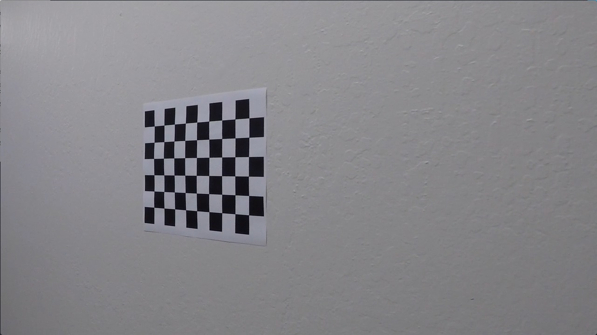

## Advanced Lane Finding
[](http://www.udacity.com/drive)


In this project, the goal was to write a software pipeline to identify the lane boundaries in a video, but the main output or product was to create is a detailed writeup of the project. 

Summary - The goals / steps of this project were the following:

* STEP 1: Compute the camera calibration matrix and distortion coefficients given a set of chessboard images.
* STEP 2: Apply a distortion correction to raw images.
* STEP 3: Use color transforms, gradients, etc., to create a thresholded binary image.
* STEP 4: Apply a perspective transform to rectify binary image ("birds-eye view").
* STEP 5: Detect lane pixels and fit to find the lane boundary.
* STEP 6: Determine the curvature of the lane and vehicle position with respect to center.
* STEP 7: Warp the detected lane boundaries back onto the original image.
* STEP 8: Output visual display of the lane boundaries and numerical estimation of lane curvature and vehicle position.

The images for camera calibration were stored in the folder called `camera_cal`. The images in `test_images` are for testing the pipeline on single frames. 

Now the details:

STEP 1:
The camera calibration was done in a separate python script (camera_calibration.py), because it is usually run only once. The code has been taken more or less from Lession 6 "Camera Calibration". To calibrate a camera, an image with known proportion can be taken, like a chess board. In this case a 9x6 chessboard was photographed from many angles and perspective. Then each image is read and converted to gray, and the OpeCV function cv2.findChessboardCorners() is called. This function returns a list of 2d image points / coordinates of the chessboard tiles. This list is appended to a list of imagepoints, while a corresponding list of 3d object points is written to a list called objectpoints. Object points, is a prodefined list like (0,0,0), (1,0,0), (2,0,0) ....,(6,5,0). After all images have been read, the opencv function cv2.calibrateCamera is used to calculate calibration matrix and distortion coefficients. At leas 20 images are needed for this calibration process.

At the end of this script, the newly calculated calibration matrix and distortion coefficients can be tested on an undistored image.

After undistortion, this image  


becomes this image: 

These are the calculated calibration matrix and distortion coefficients which are going to be hardcoded in part 2 of this submission (lane_detection.py).

```
Distortion Coefficient:
[[-0.24688775 -0.02373133 -0.00109842  0.00035108 -0.00258571]]
Camera Matrix:
[[1.15777930e+03 0.00000000e+00 6.67111054e+02]
 [0.00000000e+00 1.15282291e+03 3.86128937e+02]
 [0.00000000e+00 0.00000000e+00 1.00000000e+00]]
```


