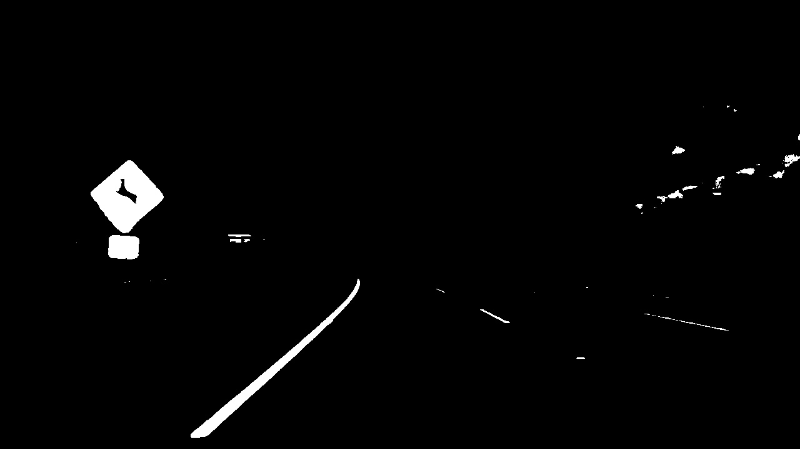
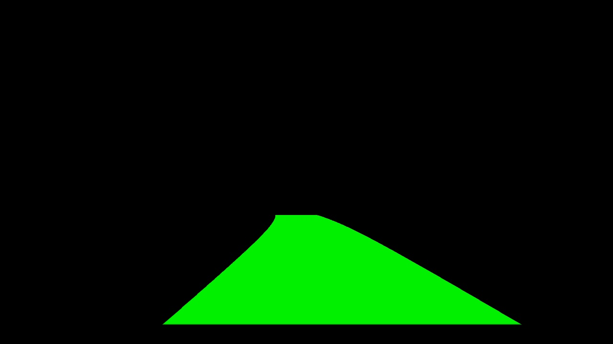

# Advanced Lane Finding
[](http://www.udacity.com/drive)


In this project, the goal was to write a software pipeline to identify the lane boundaries in a video, but the main output or product was to create a detailed writeup of the project. Video of the final result is [here](./output_images/final_20sec.mp4) (20 sec). Long video is [here](./output_images/final.mp4)


# Summary

The goals / steps of this project were the following:

* STEP 1: Compute the camera calibration matrix and distortion coefficients given a set of chessboard images.
* STEP 2: Apply a distortion correction to raw images.
* STEP 3: Use color transforms, gradients, etc., to create a thresholded binary image.
* STEP 4: Apply a perspective transform to rectify binary image ("birds-eye view").
* STEP 5: Detect lane pixels and fit to find the lane boundary.
* STEP 6: Determine the curvature of the lane and vehicle position with respect to center.
* STEP 7: Warp the detected lane boundaries back onto the original image.
* STEP 8: Output visual display of the lane boundaries and numerical estimation of lane curvature and vehicle position.

The images for camera calibration are stored in the folder called `camera_cal`. The images in `test_images` are for testing the pipeline on single frames. 

## STEP 1: (camera_calibration.py)
The camera calibration was done in a separate python script (camera_calibration.py), because it is usually run only once. The code has been taken more or less from Lession 6 "Camera Calibration". To calibrate a camera, an image with known proportion can be taken, like a chess board. In this case a 9x6 chessboard was photographed from many angles and perspective. Then each image is read and converted to gray, and the OpeCV function cv2.findChessboardCorners() is called. This function returns a list of 2d image points / coordinates of the chessboard tiles. This list is appended to a list of imagepoints, while a corresponding list of 3d object points is written to a list called objectpoints. Object points, is a predefined list like (0,0,0), (1,0,0), (2,0,0) ....,(6,5,0). After all images have been read, the opencv function cv2.calibrateCamera is used to calculate calibration matrix and distortion coefficients. At least 20 images are needed for this calibration process.

At the end of this script, the newly calculated calibration matrix and distortion coefficients can be tested on an undistored image.

This original image  


becomes this image after undistortion: 

These is the calculated calibration matrix and distortion coefficients which are going to be hardcoded in part 2 of this submission (lane_detection.py).

```
Distortion Coefficient:
[[-0.24688775 -0.02373133 -0.00109842  0.00035108 -0.00258571]]
Camera Matrix:
[[1.15777930e+03 0.00000000e+00 6.67111054e+02]
 [0.00000000e+00 1.15282291e+03 3.86128937e+02]
 [0.00000000e+00 0.00000000e+00 1.00000000e+00]]
```


lane_line_detection.py is the main program for this project. In this file we open a video (or simgle image) and apply the "pipeline" to each frame. STEP 2-8 are in this python script.

For each frame the first thing we do is to undistort the frame, according to the calibration matrix and distortion coefficients from STEP 1. We hard coded these values in this python script. Line 21, 22:

```
dist = np.matrix([-0.24688775,-0.02373133,-0.00109842,0.00035108,-0.00258571])
mtx = np.matrix([[1.15777930e+03,0.00000000e+00,6.67111054e+02],[0.00000000e+00,1.15282291e+03,3.86128937e+02],[0.00000000e+00,0.00000000e+00,1.00000000e+00]])
```

## STEP 2: Apply a distortion correction to raw images (lane_line_detection.py)

In Line 231 we undistort the frame with the opencv function undistort and the calibration matrix and distortion coefficients from the previous step.
```
undistortedFrame = cv2.undistort(originalFrame, mtx, dist, None, mtx)
```

## STEP 3 - Use color transforms, gradients, etc., to create a thresholded binary image

In the function get_warped_binary we do all the steps recommended in Lesson 8, Gradients and Color spaces. This includes converting the image to HLS color space and using Sobel on the L channel in the x direction (x-gradient). Additionally we absolute the x derivative to accentuate lines away from horizontal. Finally we normalize sobelx values and we create a binary image by using some treshholds. Note: to view your binary image use ```  cv2.imshow('sxbinary', sxbinary*255) ``` (multiplay the image by 255, otherwise its black!)

```
# Convert to HLS color space and separate the V channel
hls = cv2.cvtColor(img, cv2.COLOR_RGB2HLS)
l_channel = hls[:,:,1]
s_channel = hls[:,:,2]

# Sobel x
sobelx = cv2.Sobel(l_channel, cv2.CV_64F, 1, 0) # Take the derivative in x
abs_sobelx = np.absolute(sobelx) # Absolute x derivative to accentuate lines away from horizontal
scaled_sobel = np.uint8(255*abs_sobelx/np.max(abs_sobelx))

# Threshold x gradient
sxbinary = np.zeros_like(scaled_sobel)
sxbinary[(scaled_sobel >= sx_thresh[0]) & (scaled_sobel <= sx_thresh[1])] = 1
```

The resulting image looks like this (x-gradient): 

After this we treshhold the s_channel (as recommended in Lessom 8)

```
# Threshold color channel
s_binary = np.zeros_like(s_channel)
s_binary[(s_channel >= s_thresh[0]) & (s_channel <= s_thresh[1])] = 1

```

The resulting image looks like this (s_channel): 

After this step we combine both binary images (x-gradient and s_channel)

```
# Combine the two binary thresholds
combined_binary = np.zeros_like(sxbinary)
combined_binary[(s_binary == 1) | (sxbinary == 1)] = 1    
```

Here is the result:


Next, we apply a mask, to get rid of parts of the image that might give wrong clues about lane lines. Here is the mask I use:


Note, the mask is applied to the binary image, not to the original image!


## STEP 4: Apply a perspective transform to rectify binary image ("birds-eye view").

```
binary_warped = cv2.warpPerspective(combined_binary, M, img_size, flags=cv2.INTER_LINEAR)
```

The Matrix M (and Minv) has been created previouly, according to the concept of "Perspective Transform" as explained in Lesson 7. By specifying 2d coordinates of your 3d image, and transforming them to a square, you get a birds eye view of your street.

```
# source and destination points (top left, top right, bottom right, bottom left) for warping street to birds view 
src = np.float32([[600, 450], [690, 450], [1100, 680], [280, 680]])     # these are the coodinates of the street

dst = np.float32([[offset_x, offset_y], [img_size[0]-offset_x, offset_y], [img_size[0]-offset_x, img_size[1]-offset_y], [offset_x, img_size[1]-offset_y]])
                
# use cv2.getPerspectiveTransform() to get M and Minv, the transform matrix and inverse transform matrices to warp the street to birds view and back
M = cv2.getPerspectiveTransform(src, dst)
Minv = cv2.getPerspectiveTransform(dst,src)
```

The resulting "warped" image looks like this:


## STEP 5 - Detect lane pixels and fit to find the lane boundary

In step 5 we are passing the warped/top down  view of the road binary image to the function "fit_polynomial", to determine the actual curve / lane lines.

```
left_fit_p, right_fit_p, left_curverad, right_curverad, left_fit_m, right_fit_m = fit_polynomial(binary_warped)
```
(If you want to visualize the boxes and actual lines lines, append "True" to the call to fit_polynomial: ``` fit_polynomial(binary_warped, True) ```

The function fit_polynomial in turn calls "find_lane_pixels" to find the lane pixels.

In find_lane_pixels we do the following:

First, we create an output image to draw on and visualize the result. np.dstack takes a sequence of arrays and stack them along the third axis to make a single array. This is a simple way to stack 2D arrays (images) into a single 3D array for processing. If we pass in 3 times our binary image, we get 3D array for processing.

```
out_img = np.dstack((binary_warped, binary_warped, binary_warped))
```

Next, we take a histogram of the bottom half of the image

```
histogram = np.sum(binary_warped[binary_warped.shape[0]//2:,:], axis=0)
```

to visualize the histogram do this

```
plt.plot(histogram)
plt.show()
```

and the result will be the following image. Here we see at which x coordinate in the bottom half of the image we have the most pixels - this is a very good indicator of where the line starts.


Find the peak of the left and right halves of the histogram. These will be the starting point for the left and right lines.
numpy.argmax returns the indices of the maximum values along an axis.

```
midpoint = np.int(histogram.shape[0]//2)      # for the current frame, the result is midpoint=640; "//" make a div with an int as result
leftx_base = np.argmax(histogram[:midpoint])  # for the current frame, the result is leftx_base=335
rightx_base = np.argmax(histogram[midpoint:]) + midpoint  # for the current frame, the result is rightx_base=975
```

In the next step, we are using "sliding windows", to determine the shape of the curve (code mostly taken from tutorial).
To do this we need a few parameters.

Choose the number of sliding windows, set the width of the windows +/- margin, and set the minimum number of pixels found to recenter window

```
nwindows = 9
margin = 100
minpix = 50
```

Set height of windows - based on nwindows above and image shape: binary_warped.shape[0] is the height of the image
```
window_height = np.int(binary_warped.shape[0]//nwindows)
```

Identify the x and y positions of all nonzero pixels in the image (this is code from the tutorial)

```
nonzero = binary_warped.nonzero()
nonzeroy = np.array(nonzero[0])
nonzerox = np.array(nonzero[1])

# Current positions to be updated later for each window in nwindows
leftx_current = leftx_base
rightx_current = rightx_base

# Create empty lists to receive left and right lane pixel indices
left_lane_inds = []
right_lane_inds = []

# Step through the windows one by one
for window in range(nwindows):
    # Identify window boundaries in x and y (and right and left)
    win_y_low = binary_warped.shape[0] - (window+1)*window_height
    win_y_high = binary_warped.shape[0] - window*window_height
    win_xleft_low = leftx_current - margin
    win_xleft_high = leftx_current + margin
    win_xright_low = rightx_current - margin
    win_xright_high = rightx_current + margin
    
    # Draw the windows on the visualization image
    if plot_it:
        cv2.rectangle(out_img,(win_xleft_low,win_y_low),
        (win_xleft_high,win_y_high),(0,255,0), 2) 
        cv2.rectangle(out_img,(win_xright_low,win_y_low),
        (win_xright_high,win_y_high),(0,255,0), 2) 
    
    # Identify the nonzero pixels in x and y within the window #
    good_left_inds = ((nonzeroy >= win_y_low) & (nonzeroy < win_y_high) & 
    (nonzerox >= win_xleft_low) &  (nonzerox < win_xleft_high)).nonzero()[0]
    good_right_inds = ((nonzeroy >= win_y_low) & (nonzeroy < win_y_high) & 
    (nonzerox >= win_xright_low) &  (nonzerox < win_xright_high)).nonzero()[0]
    
    # Append these indices to the lists
    left_lane_inds.append(good_left_inds)
    right_lane_inds.append(good_right_inds)
    
    # If you found > minpix pixels, recenter next window on their mean position
    if len(good_left_inds) > minpix:
        leftx_current = np.int(np.mean(nonzerox[good_left_inds]))
    if len(good_right_inds) > minpix:        
        rightx_current = np.int(np.mean(nonzerox[good_right_inds]))

# Concatenate the arrays of indices (previously was a list of lists of pixels)
try:
    left_lane_inds = np.concatenate(left_lane_inds)
    right_lane_inds = np.concatenate(right_lane_inds)
except ValueError:
    # Avoids an error if the above is not implemented fully
    pass

# Extract left and right line pixel positions
leftx = nonzerox[left_lane_inds]
lefty = nonzeroy[left_lane_inds] 
rightx = nonzerox[right_lane_inds]
righty = nonzeroy[right_lane_inds]

# leftx, lefty are the pixels part of the left lane
# rightx, righty are the pixels part of the right lane

return leftx, lefty, rightx, righty, out_img
```

In fit_polynomial, after we received the pixels of the left and right lane that are supposed to be part of the left and right lane
we try to draw a line: This can be done with np.polyfit - which draws a least squares polynomial fit. We do this once  in pixel coordinates and once in meters. We need line in pixels for drawing the line onto the screen, and in meters for calculating the radius and the position of the car within the lanes.
```
# Fit a second order polynomial to each using `np.polyfit`
left_fit = np.polyfit(lefty, leftx, 2)
left_fit_m = np.polyfit(lefty*ym_per_p, leftx*xm_per_p, 2)   # for radius calculation
right_fit = np.polyfit(righty, rightx, 2)
right_fit_m = np.polyfit(righty*ym_per_p, rightx*xm_per_p, 2)  # for radius calculation
```

On this picture you see the pixels, the boxes, and in yellow the line that goes through the pixels


Note: To plot this image, look at the code and set the second parameter of fit_polynomial (plot_it) to True

## STEP 6 - Determine the curvature of the lane and vehicle position with respect to center

```
# We'll choose the maximum y-value -1, corresponding to the bottom of the image, where we want radius of curvature
y_eval = binary_warped.shape[0]-1
# Calculation of R_curve (radius of curvature)
left_curverad = ((1 + (2*left_fit_m[0]*y_eval*ym_per_p + left_fit_m[1])**2)**1.5) / np.absolute(2*left_fit_m[0])
right_curverad = ((1 + (2*right_fit_m[0]*y_eval*ym_per_p + right_fit_m[1])**2)**1.5) / np.absolute(2*right_fit_m[0])

# left_fit - Polynomial coefficients of the left curve to draw the curve on the image
# right_fit - Polynomial coefficients of the right curve to draw the curve on the image
# left_curverad - the radious of the left curve
# right_curverad - the radious of the right curve
# left_fit_m- Polynomial coefficients of the left curve to calculate the offset of the car
# right_fit_m- Polynomial coefficients of the right curve to calculate the offset of the car

return left_fit, right_fit, left_curverad, right_curverad, left_fit_m, right_fit_m
```

## STEP 7 - Warp the blank back to original image space using inverse perspective matrix (Minv)


After the lane lines have been computed, turn the coordinates into a polygon and draw it
```
# Create an image to draw the lines on
rows, cols = binary_warped.shape[:2]
warp_zero = np.zeros(undistortedFrame.shape[:2], dtype=np.uint8)
lane_image = np.dstack((warp_zero, warp_zero, warp_zero))

# generate the plot points
plot_y = np.linspace(0, rows-1, rows) # return evenly spaced numbers over a specified interval.
left_fit_x = np.polyval(left_fit_p, plot_y)  # calculate the points for the left lane 
right_fit_x = np.polyval(right_fit_p, plot_y) # calculate the points for the right lane 

# Put left and right points together
leftPoints2Lists = np.vstack([left_fit_x, plot_y])
rigthPoints2Lists = np.vstack([right_fit_x, plot_y])

# make array with [x,y],[x,y],... 
leftPoints = np.transpose(leftPoints2Lists)
rightPoints = np.flipud(np.transpose(rigthPoints2Lists))

# lets put the points in yet another array 
leftPointsArray = np.array([leftPoints])
rightPointsArray = np.array([rightPoints])

# stack arrays in sequence horizontally (column wise).
polygon_pts = np.hstack((leftPointsArray, rightPointsArray))

# draw the polygon/lane onto the warped blank image
cv2.fillPoly(lane_image, np.int_([polygon_pts]), (0,240, 0))
```

At this point lane_image looks like this:


Now we warp the image back to the drivers perspective using the inverse matrix of the one we used to warp it to birds view

```
lane_image_warped = cv2.warpPerspective(lane_image, Minv, undistortedFrame.shape[1::-1])
```

After warping the image looks like this



## STEP 8 Output visual display of the lane boundaries and numerical estimation of lane curvature and vehicle position.

At the very final step, we add the warped lane image on undistorted frame with a weight such that it appears transparent. We also compute the position of the car within the road and add texts onto the street. 

```
result = cv2.addWeighted(undistortedFrame, 1, lane_image_warped, 0.25, 0)

offcenter = get_offcenter(result, left_fit_m, right_fit_m)
    
font = cv2.FONT_HERSHEY_SIMPLEX
cv2.putText(result, 'Radius of curvature: {0:>10.3f} m'.format(left_curverad), (20,60), font, 1.5, (255, 255, 255), 2, cv2.LINE_AA)
cv2.putText(result, 'Distance from lane center: {0:>10.3f} m'.format(offcenter), (20,130), font, 1.5, (255, 255, 255), 2, cv2.LINE_AA)
```


Video of the final result is [here](./output_images/final_20sec.mp4) (20 sec). Long video is [here](./output_images/final.mp4)

# Discussion 

__Briefly discuss any problems / issues you faced in your implementation of this project. Where will your pipeline likely fail? What could you do to make it more robust?__

This implementation follows closely the tutorial. However, I have not implemented the suggestion from the tutorial to search from the prior frame and therefore skip the sliding window step.

## Challenges

This implementation struggles with cases where the road has been repaired and there are other "lane like" lines along the road (see the movie challenge_video.mp4).

Also the "harder_challenge_video.mp4" causes even more challenges, most likely because of the various shades and lighter spots on the road.

I also tested this implementation with my own videos and it struggled a lot when there were no lines at all, like at a cross road.

Another difficulty could be if the driver is not driving between two lanes.

In any case, this was really a great second project, because it exposed the students to the many situations and scenarios a self driving car might encounter. I believe to get this done really well, you need to spend years (not days) on a really sophisticated lane detection algorithm.